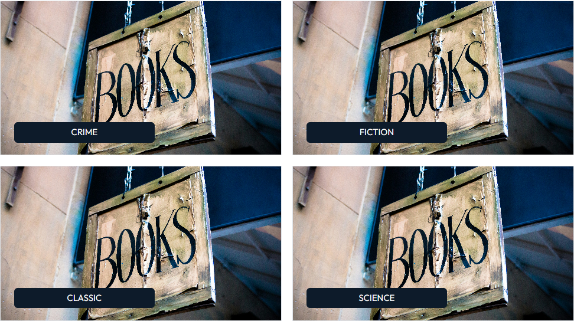
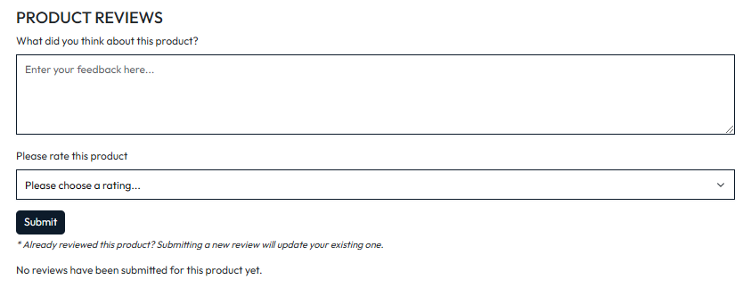

## **Shelly's Corner**

## **Site Overview**

Shally's Corner is an online e-commerce store selling different book genres. Users are able to browse and purchase books directly through the website, make an account to keep track of their order history, leave reviews for products they have purchased and contact the company for an inquiry via a contact form.

| SuperUser | Name: Chris | Password: MaryShelly12! |

[View the deployed project here](https://shellys-corner-5b60b12a8abf.herokuapp.com/)


- [**Shelly's Corner**](#shellys-corner)
- [**Site Overview**](#site-overview)
- [**Table of contents**](#table-of-contents)
- [**Planning stage**](#planning-stage)
  - [**Target Audiences**](#target-audiences)
  - [**User Stories**](#user-stories)
  - [**Site Aims**](#site-aims)
  - [**Database Schema**](#database-schema)
  - [**Wireframes**](#wireframes)
  - [**Color Scheme**](#color-scheme)
- [**Typography**](#typography)
- [**Features**](#features)
- [**Future Enhancements**](#future-enhancements)
- [**Testing Phase**](#testing-phase)
  - [**Responsiveness**](#responsiveness)
  - [**Functionality**](#functionality)
  - [**Validators**](#validators)
  - [**Testing user stories**](#testing-user-stories)
- [**Bugs**](#bugs)
- [**Deployment**](#deployment)
- [**Tech**](#tech)
- [**Credits**](#credits)
  - [**Honourable mentions**](#honourable-mentions)

## **Planning stage**

### **Target Audiences**

- Users that want buy a book.
- Users in need of book to study.
- Users in need of book as a gift for a friend or relative.

### **User Stories**

**As a new user, I want to**:

1. Immediately understand the site's purpose
2. Easily navigate the website
3. Browse all available products
4. Filter products to quickly find what I need
5. Search for products
6. Contact the company for help or advice
7. Purchase products without registering for an account
8. Browse product reviews left by other users
9. Stay informed on actions I take throughout the website
10. Receive confirmation of my order
11. Access the site on any device
12. Create and log into an account

**As a registered user, I want to**:

13. View my profile page
14. View my previous order history
15. View and update my personal information
16. Create reviews for products I have purchased
17. View reviews for products I have purchased
18. Update reviews for products I have purchased
19. Delete reviews for products I have purchased
20. Change my password
21. Make purchases without filling in my personal information each time
22. Logout of my account

**As an admin, I want to**:

23. Add new products to the store
24. Update existing products
25. Delete existing products
26. Delete existing reviews

### **Site Aims**

- Provide a simple and responsive online shop for quick book purchases.
- Allow account registration to manage past orders, personal data and reviews.
- Offer clear feedback on user actions, confirming successes and alerting to issues.
- Implement a contact form for customer assistance and support.

### **Database Schema**


### **Wireframes**

The original wireframes for the main pages of the store can be found below. During development, a few decisions were made to change the original structure.

<br>

<details>
<summary>Home Page</summary>
<br>

</details>
<br>

<details>
<summary>Profile Page</summary>
<br>

</details>
<br>

<details>
<summary>Contact Page</summary>
<br>

</details>
<br>

<details>
<summary>Products Page</summary>
<br>

</details>
<br>

<details>
<summary>Product Detail Page</summary>
<br>

</details>
<br>

<details>
<summary>Shopping Bag</summary>
<br>

</details>
<br>

<details>
<summary>Checkout Page</summary>
<br>

</details>
<br>

<details>
<summary>Order Confirmation Page</summary>
<br>

</details>

### **Color Scheme**

- Navy: #0D1B2A
- Blue: #415A77
- Black: #000
- White: #fff
- Grey: #d5d5d5 (used when hovering navigation links)

The [WCAG Color Contrast Checker](https://accessibleweb.com/color-contrast-checker/) was used to ensure that any navy/blue and white/grey combinations were suitable for use. All results passed except the small text in the AAA test for the blue/grey combination, however after a discussion with my mentor we agreed this was OK as the criteria for the AAA testing is incredibly high and almost never passes.


## **Typography**

I decided to import and use the Outfit font using Google Fonts for the store, with Helvetica and sans-serif acting as the back up fonts should the Outfit import fail.

## **Features**

### **Features common to all pages**

**Navigation**


- **Search bar**: Users can quickly search for products. If the search bar is empty but the user clicks the search button, they receive a message informing them that no search term was entered. The search function finds results matching the product name or description, maximizing the chances of finding what's needed.
- **Logo**: The Shelly's Corner logo was designed to be instantly recognizable as that of a home goods store. Clicking on the logo returns you to the main page.
- **My Account**: The options in the "My Account" dropdown menu vary based on the user's login status and whether they are a superuser. Non-authenticated users will see options to register and log in. Authenticated users will see their profile and an option to log out. Superusers will also have the option to add new products.
- **Shopping Bag**: The shopping bag displays the current total of purchases and, when clicked, takes the user to the shopping bag page.
- **Main nav links**: The blue navigation bar contains the main links for efficiently exploring the site. A "Home" button is included to return to the homepage from any point on the site. To find products, users can browse by category or use the complete list, with or without sorting options.
- **Free delivery banner**: A banner constantly informs the user of the minimum spend required for free shipping. This encourages increasing purchases if close to the free shipping threshold.

<br>

**Mobile Navigation**


- **Burger icon**: On smaller devices, the main navigation bar is hidden within the burger icon positioned on the left.
- **Search**: The search functionality operates identically across all devices. However, on more compact screens, the search bar appears as a dropdown menu that activates when clicking on the designated button, thus enhancing the user experience.
- **Other links**: The other interactive elements, such as the logo, access to personal account, and shopping cart, maintain the same functionality as described earlier, adapting to the device's layout.

<br>

**Footer**


- **Quick links**: Quick links are provided at the bottom of the page, allowing users to rapidly access their desired products.
- **Contact Us**: The store's address, phone number, and email address are visible on all pages, enabling users to easily and directly get in touch with the store.
- **Social Media Links**: Links to the store's social media profiles are available for users who wish to follow it on platforms such as Facebook, Instagram, YouTube.
<br>

**Messages**


- This box appears when a message is sent to the user to inform them about the success or failure of an action they have performed on the website.
- **Success message**: This is displayed when the user has successfully completed an action, such as adding an item to their cart, placing an order, submitting a contact form inquiry, or logging in/out. If the user has items in their cart, they will also see a link to proceed to checkout. Additionally, if they haven't spent enough for free shipping, they are informed about how much more they need to spend to reach the threshold.
- **Warning message**: This appears when it not necessary to warn the user about an action they've taken on the site.
- **Info message**: This is shown when the user needs to receive information about an action they've performed on the site.
- **Error message**: This is displayed to inform the user of an error related to an action they've taken.
### **Other Features**

**Home Page**


- This is one of the first elements the user will notice upon entering the site. The text and main image help to immediately understand the website's purpose. A "Shop Now" button is present to allow users to start shopping quickly and easily, directing them to the all products page. 

<br>



- To provide a more specific understanding of the store's offerings, categories are neatly presented right after, enabling users to immediately begin shopping by category if they already know which area of their home they wish to furnish.
**Products page**


- **Sorting**: Users can sort products on any page using various parameters. When sorting by rating, products with a score are displayed first, followed by those without a current rating.
- **Product layout**: On wider screens, the site maximizes width by showing 4 products per row. The number of products per row decreases as the screen/device size reduces. Even on small devices, two products are placed side by side to prevent users from having to scroll excessively to view all products. All details remain clearly visible even with two products per row.
- **Rating**: The product score (if available) is calculated as an average of all review ratings submitted for that product to date.
- **Link to product**: When hovering over the product image, name, or price, these elements are underlined to clearly indicate to the user that clicking will open the product page. When hovering over the category, only this is underlined, linking to the relevant category page.

**Product detail page**


- **Image**: Clicking on the image opens a new tab with an enlarged version of the product.
- **Price**: TThe product price is clearly highlighted, allowing users to quickly assess the affordability of the purchase.
- **Category**: The product category is indicated with a relevant icon. Clicking on it takes the user to the category page to explore similar products.
- **Rating**: The product rating, if available, is visible both here and on the products page.
- **Edit/Delete product**: Administrators have access to buttons to edit or delete products directly from the site. Deletion requires confirmation via a modal window to prevent accidental removals.
- **Description**: Provides additional details about the product, complementing the information already present in the name.
- **Quantity select**: Users can select a quantity between 1 and 99. The system automatically prevents the input of out-of-range values, both through buttons and manual entry. If the total quantity in the cart exceeds 99, the user is informed that the maximum allowed value will be set.
- **Buttons**: Options are available to return to the products page or add the item to the cart. Adding to the cart generates a confirmation message for the user.

**Reviews (Product detail page)**



- Authenticated users have access to a form for leaving reviews on products listed on the website. They can input their feedback and assign a rating to the product, then submit the review which will be visible to all other users. The form can only be submitted if both feedback and a rating have been entered; otherwise, a pop-up notifies the user to complete both fields before proceeding.
- If a user has already reviewed the product in question, submitting a new form will update their existing review. This option is provided in case the user has changed their opinion about the product. Additionally, it prevents a dissatisfied customer from leaving multiple negative reviews, which would unfairly affect the overall product rating.
- For non-authenticated users, the form is not visible. Instead, a message is displayed inviting them to log in or register to leave a review, with direct links to the login and registration pages to facilitate the process.
- Once submitted, the review is displayed in the list below the form (further details on this aspect will be provided later).

<br>


- All submitted reviews are displayed in the list below the form, visible to all users. To optimise space and organise them neatly, they are stored within a Bootstrap accordion.
- Users who have left a review have the option to delete it if they wish. Additionally, the superuser has the authority to remove any review present on the site, for example in case of inappropriate language. When a user selects the delete option, a confirmation prompt appears to prevent accidental deletions.
- In the absence of reviews, the list is not shown, and a message appears instead, informing that no reviews have been submitted yet.

**Shopping bag**


- The shopping bag page displays the items that the user has added while browsing the site. If the cart is empty, a message is shown along with a button to return to shopping.
- **Quantity / Update**: Users can modify the quantity of each item in the cart and update the total. Controls are in place to limit the quantity between 1 and 99, with informative messages for invalid attempts.
- **Remove item**: It is possible to completely remove items from the bag.
- **Product image**: Product images are clickable to return to the product page.
- **Subtotal**: The subtotal for each product updates automatically when the quantity is modified.
- **Free delivery threshold**: If the amount is below the £100 threshold for free shipping, a message appears indicating how much more is needed to reach it.
- **Buttons**:  Buttons are available to continue shopping or proceed to checkout.

**Checkout**


- The payment form contains all the necessary details required from the user to process their order, including full name, email address, and delivery information.
- **Save info**: A checkbox is available, offering users the option to save their information to their profile. By choosing this option, their details will be automatically pre-filled for their next order. Users can update this information on their profile page if they wish. If the user is not logged in, a message is displayed prompting them to log in or register to save their information.
- **Stripe**: The store uses Stripe to process payments. When the button to complete the order is clicked, a loading animation appears until the processing is complete, aiming to prevent users from leaving the page during the payment process. A brief notice is shown to the user informing them of the amount that will be charged to their card.

<br>

**Checkout Confirmation**


- After the user successfully completes an order, a confirmation page is displayed containing the order details, delivery and billing information.
- **Email**: An order confirmation is also sent to the user's email address, including the complete purchase details.
- **Order number**: A unique order number is provided for that specific transaction, allowing easy and exclusive reference to the order in the future if needed.
- **Continue Shopping**: If the user wishes to purchase more products, they can use the designated button to be redirected to the products page.

<br>


- n addition to the order confirmation provided above and the email received by the user, a success message is also displayed in the top right corner, specifically to give them extra assurance that their order has been successfully submitted.

**Login page**


- The access page is where users can authenticate themselves into their pre-registered account. If a user doesn't have an account yet, they have the option to create one using the provided link. Additionally, they can reset their password in case they have forgotten it.

**Sign up page**


- The registration page allows users to create an account. As part of the validation process, users must enter matching email addresses and passwords. The site will also notify them if they attempt to use a username that is already taken. If a user tries to sign up using an email address already in the database, an email will be sent to that address to inform the person who has access to it, in case someone is attempting to commit fraud.

**Password reset page**


- This page allows users to reset their password if they've forgotten it, eliminating the need to create a new account just because they can't remember their password.


**Add a product**


- This page is accessible only to the administrator, therefore customers without authorization cannot access it either from the product details page or by entering /products/add/ in the address bar.
- In this section, the administrator can add products to the store, selecting all relevant details without having to access the administration panel.

**Edit product**


- This page is accessible only to the system administrator, therefore customers without authorization cannot access it either through the product details page or by entering /products/edit/ in the address bar.
- In this section, the administrator has the ability to modify existing products in the store.

**Profile page**


- This is the user's profile page. Here they can update their personal details.
- Users can also view their previous order history. By clicking on the abbreviated version of their order number, they are directed to a page displaying the full order details, in case they need to review what they purchased.

**Contact page**


- The contact page is where users can find various methods to communicate with the store.
- **Contact form**: The contact form provides users with a way to send a message to the store and receive a response. It requires a name, email, subject, and message text. Once submitted, the form is sent to the In Home team's email address, allowing them to assist the customer. If the user is already logged in, their email address is automatically filled in.
- **Contact details**: The contact page also includes the company's contact details, in case the user wishes to reach out to the store directly.

## **Future Enhancements**

Some potential improvements that could be implemented in the future include:

- A section in the user profile that displays previous reviews left for products, with the option to edit or delete them directly from the profile
- A featured products section above the footer visible on every page of the site, allowing the store to promote the most popular items or those they wish to push at any given time.
- A social account login feature, enabling users to log in to the site using their social media profile instead of an email.
- A special offers section for any discounted products or available promotions.
- A "You might also like..." section at the bottom of each product page showing items potentially interesting to the user based on what they are currently viewing.
- A "Recommended for you" section on the user profile page suggesting products that might interest them based on their previous order history.
- A newsletter subscription, so the store can promote its products and special offers directly to interested users.
- Product images could be converted to WebP format to enable faster page loading.

## **Testing Phase**

### **Responsiveness**

Responsiveness was checked and worked as intended with the following browsers and screen sizes:

- Extra Large (27" Mac Desktop):

  - Chrome
  - Safari
  - Firefox

- Large (15" MacBook Pro Laptop):

  - Chrome
  - Firefox
  - Safari

- Medium (10.9" iPad):

  - Chrome
  - Safari
  - Firefox

- Small (6" iPhone 13):

  - Chrome
  - Safari
  - Firefox

DevTools was also used to check the responsiveness at various screen sizes and devices from the list of devices available. All were fully responsive and caused no issues, including the smallest device available in the list which was a Galaxy Z Fold 5.

### **Functionality**
                                                                                                                                      
| Function                                             | Expectation                                                                                                                                           | Pass? |
|------------------------------------------------------|-------------------------------------------------------------------------------------------------------------------------------------------------------|-------|
| **Navigation**                                           |                                                                                                                                                       |       |
| Search Bar (with search criteria)                    | On submit, redirect to products page showing products with names or descriptions matching users criteria                                               | Yes   |
| Search Bar (no search criteria)                      | On submit, user is informed they submitted an empty search                                                                                            | Yes   |
| Logo                                                 | On click, redirect to home page                                                                                                                        | Yes   |
| My Account (logged out user)                         | On click, dropdown appears with register and login links. 'Register' directs  to the sign up page, 'Login'   to login page.                             | Yes   |
| My Account (logged in user)                          | On click, dropdown appears with profile and logout links. 'My Profile' directs to users profile page, 'Logout'  to logout confirm page.                 | Yes   |
| My Account (logged in superuser)                     | On click, superuser has same options as above plus 'Add a product' which directs them to the add product page.                                          | Yes   |
| Shopping Bag                                         | On click, takes user to the shopping bag page.                                                                                                         | Yes   |
| Shopping Bag Total                                   | Default value shown is £0.00 unless user has items in their shopping bag, in which case amount shown should reflect the bag total.                      | Yes   |
| Home Nav Link                                        | On click, takes user to the home page.                                                                                                                 | Yes   |
| All Products Nav Link                                | On click, dropdown appears with relevant options, all linking to their relevant pages.                                                                 | Yes   |
| Kitchen Nav Link                                     | On click, dropdown appears with relevant options, all linking to their relevant pages.                                                                 | Yes   |
| Living Room Nav Link                                 | On click, dropdown appears with relevant options, all linking to their relevant pages.                                                                 | Yes   |
| Bedroom Nav Link                                     | On click, dropdown appears with relevant options, all linking to their relevant pages.                                                                 | Yes   |
| Bathroom Nav Link                                    | On click, dropdown appears with relevant options, all linking to their relevant pages.                                                                 | Yes   |
| Contact Nav Link                                     | On click, takes user to the contact page.                                                                                                               | Yes   |
| **Footer**                                               |                                                                                                                                                       |       |
| Quick Links                                          | On click, each link takes the user to the relevant page.                                                                                               | Yes   |
| Telephone Number                                     | On click, the site attempts to start a phone call direct to the store.                                                                                  | Yes   |
| Email                                                | On click,  the store attempts to start an email direct to the store via the users default email provider.                                               | Yes   |
| Social Media Links                                   | On click, user is directed to the relevant social media platform.                                                                                      | Yes   |
| **Home Page**                                            |                                                                                                                                                       |       |
| Shop Now                                             | On click, takes user to the all products page.                                                                                                         | Yes   |
| Kitchen Category Image                               | On click (on the image or the button), takes user to the kitchen products page.                                                                        | Yes   |
| Living Room Category Image                           | On click (on the image or the button), takes user to the living room products page.                                                                    | Yes   |
| Bedroom Category Image                               | On click (on the image or the button), takes user to the bedroom products page.                                                                        | Yes   |
| Bathroom Category Image                              | On click (on the image or the button), takes user to the bathroom products page.                                                                       | Yes   |
| **Products Page**                                        |                                                                                                                                                       |       |
| Link to product detail                               | For each product shown, the product image, name and price all link to that products detail page.                                                       | Yes   |
| Link to category                                     | For each product shown, the products category shown links to the category that product belongs to.                                                     | Yes   |
| Sorting by price                                     | Sorting  low to high displays the products in ascending order by price, and high to low in descending order.                                           | Yes   |
| Sorting by name                                      | Sorting  A-Z displays the products in alphabetical order by name, and Z-A in the reverse order.                                                        | Yes   |
| Sorting by rating                                    | Sorting  low to high displays the products in ascending order by rating, and high to low in descending order. Products with  ratings are always displayed first. | Yes   |
| Sorting by category                                  | Sorting  A-Z displays the products in alphabetical order by category, and Z-A in the reverse order.                                                    | Yes   |
| Products Home                                        | On click, products Home link directs the user to the all products page                                                                                 | Yes   |
| Products total                                       | Total number of products matches total number actually shown on page                                                                                   | Yes   |
| Products (search query)                              | When user is taken to the products page from a search query, page confirms how many products were found based on their search criteria.                 | Yes   |
| **Product Detail Page**                                  |                                                                                                                                                       |       |
| Image                                                | On click, image opens in a new tab                                                                                                                     | Yes   |
| Category                                             | On click, user is directed to the category in which the product belongs to                                                                             | Yes   |
| Edit (superuser only)                                | When superuser is logged in, edit link is shown which directs superuser to the edit product page                                                       | Yes   |
| Delete (superuser only)                              | When superuser is logged in, delete link is shown which prompts the delete product modal. The delete button deletes the product                        | Yes   |
| Quantity Decrease (-)                                | On click, quantity is reduced by 1 (unless quantity is already 1, then decrease button is disabled)                                                    | Yes   |
| Quantity Increase (+)                                | On click, quantity is increased by 1 (unless quantity is 99, then increase button is disabled)                                                         | Yes   |
| Quantity input, manual entry                         | If a quantity below 1 or above 99 is manually entered, user is told to enter a valid quantity when attempting to add the product to the bag             | Yes   |
| Keep shopping                                        | On click, user is directed to the all products page                                                                                                    | Yes   |
| Add to bag (product not already in bag)              | On click, product is added to the users shopping bag in the desired quantity, with success message confirming the action and a button to proceed to the checkout. Bag total to update at top of page | Yes   |
| Add to bag (product already in bag)                  | If product already in users bag and a further quantity is added making the new quantity above 99, bag quantity is set to 99 and user is informed. Otherwise, update bag quantity & total accordingly. | Yes   |
| Product Review Form (logged in user)                 | For logged in users, product review form to be displayed and only submitted when feedback is entered and a rating is selected.                          | Yes   |
| Product Review Form (user not logged in)             | Form is hidden and prompt for user to either login or register for an account is displayed.                                                            | Yes   |
| Product Review Form Submission                       | On submit (provided validation criteria is met), review is added to the reviews accordion style list below.                                             | Yes   |
| Product reviews                                      | If no reviews have been submitted for that product yet, message is displayed to that effect. Otherwise, reviews are stacked in a collapsable list.     | Yes   |
| Product reviews, delete                              | When viewing a review, if it belongs to the logged in user or a superuser is logged in, delete button appears which prompts the delete review modal. Clicking the modals delete button deletes the review. | Yes   |
| **Shopping Bag page**                                    |                                                                                                                                                       |       |
| No products                                          | If no products are currently in the shopping bag, user is informed their bag is empty and provided with a keep shopping button which directs them to the all products page. | Yes   |
| Products in bag                                      | If products are in the shopping bag, each products image, name, price, quantity and subtotal is shown                                                  | Yes   |
| Product image                                        | Product image directs user to that particular product                                                                                                  | Yes   |
| Update quantity (outside of 1-99 range)              | Update quantity to include same validation checks as on the product detail page to ensure quantity is always between 1 and 99. Message appear to inform the user if they try to go outside of the range | Yes   |
| Update quantity (inside of 1-99 range)               | On click, quantity, subtotal, bag total and grand total to be updated accordingly. Delivery total to be updated if under free delivery threshold        | Yes   |
| Remove                                               | On click, product is removed from the bag. Bag total and grand total updated accordingly (or revert to no products in bag message if last product is removed). If now below free delivery threshold, delivery total updated accordingly. | Yes   |
| Keep shopping                                        | On click, direct user to all products page                                                                                                             | Yes   |
| Secure checkout                                      | On click, direct user to checkout page                                                                                                                 | Yes   |
| **Checkout page**                                        |                                                                                                                                                       |       |
| Pre filled details                                   | If user is logged in and profile information is saved, customers details are pre-filled accordingly.                                                   | Yes   |
| Save delivery information (logged in user)           | If user is logged in, checkbox to save delivery information is shown. Once order is placed, delivery information on profile page is updated.            | Yes   |
| Save delivery information (user not logged in)       | If user is logged is not logged in, prompt to login or register appears taking them to the relevant pages.                                              | Yes   |
| Adjust bag                                           | On click, direct user back to the shopping bag                                                                                                          | Yes   |
| Charge warning                                       | Red warning message for charge amount to match the grand total on same page.                                                                           | Yes   |
| Product image                                        | Product image in order summary to link to product page                                                                                                 | Yes   |
| Complete order                                       | On click, loading spinner appears while order is processed. If order is successful, direct user to order confirmation page and success message appears. Clear shopping bag and reset bag total to £0.00 | Yes   |
| Complete order continued                             | With successful order, if user is logged in, add order to order history on profile page and sent confirmation of order to users email address           | Yes   |
| **Order confirmation page**                              |                                                                                                                                                       |       |
| Order details                                        | All order details shown to match those that were entered originally. Unique order number assigned to the order                                         | Yes   |
| Missed something                                     | Missed something button to direct user to all products page                                                                                            | Yes   |
| **Profile page**                                         |                                                                                                                                                       |       |
| Delivery information                                 | If user has previously saved delivery info via checkout page or previously saved via profile page, details are pre-populated.                          | Yes   |
| Change password                                      | On click, direct user to change password page                                                                                                          | Yes   |
| Update information                                   | On click, update any changed details in form above                                                                                                     | Yes   |
| Order history                                        | All previous orders to be displayed, with order number acting as a link to order page. When clicked, message to appear informing user they are viewing an existing order | Yes   |
| **Logout Page**                                          |                                                                                                                                                       |       |
| Cancel                                               | On click, directs user to Home page and user is not logged out                                                                                         | Yes   |
| Sign out                                             | On click, logs the user out, message appears to confirm and user is directed to the home page                                                          | Yes   |
| **Sign Up/Register Page**                                |                                                                                                                                                       |       |
| Sign in link                                         | On click, directs user to login page                                                                                                                   | Yes   |
| Email validation                                     | On submit/sign up, if email address doesn’t match email address confirmation field, user is informed must retry with correct details                   | Yes   |
| Username validation                                  | On submit/sign up, if username already exists, user is informed to make another choice                                                                 | Yes   |
| Password validation                                  | On submit/sign up, if passwords don't match or meet the minimum criteria, user is informed with instructions as to what they must do to meet criteria  | Yes   |
| Back to login                                        | On click, directs user to login page                                                                                                                   | Yes   |
| Sign up                                              | On click, if all validation checks pass, user is sent an email to confirm their email address and registration. Once confirmed, account is created and user can login. | Yes   |
| Sign up (email already registered)                   | As above, but email to user mentions that someone has tried to create an account using their email, but an account already exists.                     | Yes   |
| **Login page**                                           |                                                                                                                                                       |       |
| Signup link                                          | On click, directs user to sign up/register page                                                                                                        | Yes   |
| Home button                                          | On click, directs user to the home page                                                                                                                | Yes   |
| Sign in                                              | On click, if username/email and password match a users details stored in database, log the user in with success message                               | Yes   |
| Forgot password                                      | On click, directs user to reset password page                                                                                                          | Yes   |
| **Change password page**                                 |                                                                                                                                                       |       |
| Back to login                                        | On click, directs user to login page                                                                                                                   | Yes   |
| Change password                                      | On click, update the users password if current password matches current password currently stored in database and new password and new password (again) both match | Yes   |
| **Reset password page**                                  |                                                                                                                                                       |       |
| Back to login                                        | On click, directs user to login page                                                                                                                   | Yes   |
| Reset my password                                    | On click, send password reset email to users email                                                                                                     | Yes   |
| **Contact page**                                         |                                                                                                                                                       |       |
| Contact form                                         | If user is logged in, email is pre-populated. On submit, if all fields are completed and match validation criteria, user is directed to home page and shown success message. Contact form is sent to In Home email address for a response | Yes   |
| **Add product page (superuser only)**                    |                                                                                                                                                       |       |
| Select image                                         | On click, opens image select window on users device. When image is selected and confirmed, message appears to user to let them know what the image will be set to. | Yes   |
| Cancel                                               | On click, direct user to all products page                                                                                                             | Yes   |
| Add product                                          | On click, provided required fields are completed/entered, add new product to store                                                                     | Yes   |
| Access                                               | If any user other than the superuser attempts to access the add product page, they are informed they can't access it                                    | Yes   |
| **Edit product page (superuser only)**                   |                                                                                                                                                       |       |
| On load                                              | Info message to inform superuser what product they are editing                                                                                        | Yes   |
| Pre-filled details                                   | Existing product details pre-filled in relevant fields                                                                                                 | Yes   |
| Select image                                         | On click, opens image select window on users device. When image is selected and confirmed, message appears to user to let them know what the image will be set to. | Yes   |
| Remove image                                         | On submit (update), if ticked, image is removed from the product                                                                                       | Yes   |
| Cancel                                               | On click, direct user to all products page                                                                                                             | Yes   |
| Update product                                       | On click, provided required fields are completed/entered, update existing product details                                                              | Yes   |
| Access                                               | If any user other than the superuser attempts to access the edit product page, they are infomred they can't access it                                   | Yes   |
| **404 page not found**                                   |                                                                                                                                                       |       |
| Page not found                                       | For any 404 page not found errors, direct user to custom 404 error page                                                                                | Yes   |
| **500 error page**                                       |                                                                                                                                                       |       |
| 500 server error page                                | For any 500 server errors, direct user to custom 500 error page                                                                                        | Yes   |

### **Validators**

**HTML Validators**

The following files were run through  [WAVE Accessibility Checker](https://wave.webaim.org/) and passed without any errors. Please note that to test each file, the complete HTML obtained from the page source on the front-end of each page was entered into the direct input section of the validator, thus avoiding errors related to django statements.

| File                         | Pass?  |
|------------------------------|--------|
| bag-total.html               | Yes    |
| bag.html                     | Yes    |
| checkout-buttons.html        | Yes    |
| checkout_success.html        | Yes    |
| checkout.html                | Yes    |
| contact.html                 | Yes    |
| index.html                   | Yes    |
| quantity_input_script.html   | Yes    |
| add_product.html             | Yes    |
| edit_product.html            | Yes    |
| product_detail.html          | Yes    |
| products.html                | Yes    |
| profile.html                 | Yes    |
| toast_error.html             | Yes    |
| toast_info.html              | Yes    |
| toast_success.html           | Yes    |
| toast_warning.html           | Yes    |
| footer.html                  | Yes    |
| main-nav.html                | Yes    |
| mobile-top-header.html       | Yes    |
| 404.html                     | Yes    |
| 500.html                     | Yes    |
| base.html                    | Yes    |
| signup.html                  | Yes    |
| login.html                   | Yes    |
| password_change.html         | Yes    |
| password_reset.html          | Yes    |

**CSS Validator**

The following files were passed through the [W3C CSS Validator](https://jigsaw.w3.org/css-validator/) and passed with no errors.

| File                       | Pass?  |
|----------------------------|--------|
| checkout.css               | Yes    |
| profile.css                | Yes    |
| base.css                   | Yes    |

**JSHint**

The [JSHint](https://jshint.com/) javascript validator was used to check the javascript used within the store. All files below passed with no errors.

| File                                       | Pass?  |
|--------------------------------------------|--------|
| bag.html (script at the bottom)            | Yes    |
| stripe_elements.js                         | Yes    |
| quantity_input_script.html                 | Yes    |
| add_product.html (script at the bottom)    | Yes    |
| edit_product.html (script at the bottom)   | Yes    |
| products.html (script at the bottom)       | Yes    |
| base.html (script at the bottom)           | Yes    |

**CI Python Linter**

All python files were passed through the [CI Python Linter](https://pep8ci.herokuapp.com/) and all passed with no errors found.

| App                          | File                  | Pass?  |
|------------------------------|-----------------------|--------|
| bag > templatetags           | bag_tools             | Yes    |
| bag                          | admin                 | Yes    |
| bag                          | apps                  | Yes    |
| bag                          | contexts              | Yes    |
| bag                          | models                | Yes    |
| bag                          | urls                  | Yes    |
| bag                          | views                 | Yes    |
| checkout                     | admin                 | Yes    |
| checkout                     | apps                  | Yes    |
| checkout                     | forms                 | Yes    |
| checkout                     | models                | Yes    |
| checkout                     | signals               | Yes    |
| checkout                     | urls                  | Yes    |
| checkout                     | views                 | Yes    |
| checkout                     | webhook_handler       | Yes    |
| checkout                     | webhooks              | Yes    |
| contact                      | admin                 | Yes    |
| contact                      | apps                  | Yes    |
| contact                      | forms                 | Yes    |
| contact                      | models                | Yes    |
| contact                      | urls                  | Yes    |
| contact                      | views                 | Yes    |
| home                         | admin                 | Yes    |
| home                         | apps                  | Yes    |
| home                         | models                | Yes    |
| home                         | urls                  | Yes    |
| home                         | views                 | Yes    |
| shellys_corner               | asgi                  | Yes    |
| shellys_corner               | settings              | Yes    |
| shellys_corner               | urls                  | Yes    |
| shellys_corner               | wsgi                  | Yes    |
| products > templatetags      | custom_filters        | Yes    |
| products                     | admin                 | Yes    |
| products                     | apps                  | Yes    |
| products                     | forms                 | Yes    |
| products                     | models                | Yes    |
| products                     | urls                  | Yes    |
| products                     | views                 | Yes    |
| products                     | widgets               | Yes    |
| profiles                     | admin                 | Yes    |
| profiles                     | apps                  | Yes    |
| profiles                     | forms                 | Yes    |
| profiles                     | models                | Yes    |
| profiles                     | urls                  | Yes    |
| profiles                     | views                 | Yes    |
| custom_storages              | custom_storages       | Yes    |
| manage                       | manage                | Yes    |

**WAVE Accessibility Checker**

The [WAVE Accessibility Checker](https://wave.webaim.org/) was used on each page of the store to ensure it is accessible as possible. All pages passed with no errors or contrast errors, apart from the following all auth pages provided by the Django framework:

- Login/Sign In
- Register/Sign Up
- Change password (when logged in)
- Reset password (when logged out)

The errors were suggesting that the input fields on these pages did not include corresponding labels. However, on click the WAVE tool points to each potential error within your code and upon inspection, each input field included a matching label. The input fields themselves include a placeholder.

**Lighthouse**

Lighthouse scores were satisfactory, however the orange level of performance was caused by Heroku, Stripe, Bootstrap and a few other sources in which nothing further could be done to improve the scores.

<br>

Desktop Lighthouse Results

<details>
<summary>Home Page</summary>
<br>

</details>
<br>

<details>
<summary>Products Page</summary>
<br>

</details>
<br>

<details>
<summary>Product Detail Page</summary>
<br>

</details>
<br>

<details>
<summary>Checkout Page</summary>
<br>

</details>
<br>

<details>
<summary>Order Confirmation Page</summary>
<br>

</details>
<br>

<details>
<summary>Contact Page</summary>
<br>

</details>
<br>

<details>
<summary>Add Product Page</summary>
<br>

</details>
<br>

<details>
<summary>Edit Product Page</summary>
<br>

</details>
<br>

<details>
<summary>Profile Page</summary>
<br>

</details>
<br>

<details>
<summary>Login Page</summary>
<br>

</details>
<br>

<details>
<summary>Register Page</summary>
<br>

</details>
<br>
<br>

Mobile Lighthouse Results

<details>
<summary>Home Page</summary>
<br>

</details>
<br>

<details>
<summary>Products Page</summary>
<br>

</details>
<br>

<details>
<summary>Product Detail Page</summary>
<br>

</details>
<br>

<details>
<summary>Shopping Bag Page</summary>
<br>

</details>
<br>

<details>
<summary>Checkout Page</summary>
<br>

</details>
<br>

<details>
<summary>Order Confirmation Page</summary>
<br>

</details>
<br>

<details>
<summary>Add Product Page</summary>
<br>

</details>
<br>

<details>
<summary>Profile Page</summary>
<br>

</details>
<br>

<details>
<summary>Login Page</summary>
<br>

</details>
<br>

<details>
<summary>Register Page</summary>
<br>

</details>

### **Testing user stories**

**User story 1**: As a new user, I want to immediately understand the site's purpose.

**Achieved?**: Yes. Upon entering the site, you are greeted with a welcome message summarising what the store sells along with a prompt to start shopping. The logo has also been designed to make it as clear as possible what the store is about, which is shown on every page of the site.

**User story 2**: As a new user, I want to easily navigate the website.

**Achieved?**: Yes. The navigation bar includes links to all pages on both desktop and mobile devices, so users are able to find what they need quickly and easily.

**User story 3**: As a new user, I want to browse all available products.

**Achieved?**: Yes. The store includes an 'All Books' section where they can view all available products, which is accessible on all devices. Browsing is made easier with options to sort by various different parameters.

**User story 4**: As a new user, I want to filter products to quickly find what I need.

**Achieved?**: Yes. Users are able to shop by category so they are able to find what they are looking for quickly and easily. 

**User story 5**: As a new user, I want to search for products

**Achieved?**: Yes. Users can search for products on all devices by using the search bar, which returns results quickly based on their input.

**User story 6**: As a new user, I want to contact the company for help or advice

**Achieved?**: Yes. The site includes a contact page where the user can submit an enquiry form to receive a response from the store. Contact details are also included, if they wish to contact the company directly themselves for an even faster response.

**User story 7**: As a new user, I want to purchase products without registering for an account

**Achieved?**: Yes. Users are able to place orders without having to register for an account.

**User story 8**: As a new user, I want to browse product reviews left by other users

**Achieved?**: Yes. Users are able to view product reviews without an account via the product detail page for the product they are interested in.

**User story 9**: As a new user, I want to stay informed on actions I take throughout the website

**Achieved?**: Yes. The user is kept informed as to whether their actions were successful or not via the messages that appear at the top right corner of the screen. Confirmation messages are included for all important actions, including adding items to the bag, placing orders and logging in or out (to name a few).

**User story 10**: As a new user, I want to receive confirmation of my order

**Achieved?**: Yes. Once an order is placed, the user is directed to a confirmation page telling them their order has been successfully placed. They will also receive an email with confirmation of their order.

**User story 11**: As a new user, I want to access the site on any device

**Achieved?**: Yes. The site is fully responsive and can be accessed on any device. In addition to testing the site on multiple devices with different screen sizes, the site was also tested using devtools with the smallest mobile device available in the list, the Galaxy Z Fold 5.

**User story 12**: As a new user, I want to create and log into an account

**Achieved?**: Yes. Users are able to create / login to their account via the 'My Account' button at the top of the screen, available on every page of the website. In addition, there are several prompts to either create and account or login to an existing account throughout the website on specific pages where relevant.

**User story 13**: As a registered user, I want to view my profile page

**Achieved?**: Yes. All registered users are provided with a profile page which can be viewed when they login.

**User story 14**: As a registered user, I want to view my previous order history

**Achieved?**: Yes. The user is able to see their previous order history on their profile page.

**User story 15**: As a registered user, I want to view and update my personal information

**Achieved?**: Yes. The user is able to view and update their personal information on their profile page.

**User story 16**: As a registered user, I want to create reviews for products I have purchased

**Achieved?**: Yes. Once logged in, users are able to create reviews for any product found within the store at the bottom of the product detail page for the product they are viewing.

**User story 17**: As a registered user, I want to view reviews for products I've purchased

**Achieved?**: Yes. Users are able to view reviews submitted by themselves or other users for any product found within the store at the bottom of the product detail page for the product they are viewing.

**User story 18**: As a registered user, I want to update reviews for products I've purchased

**Achieved?**: Yes. Users can update their existing reviews by submitting a new review for the same product as the existing review, which will overwrite / update it.

**User story 19**: As a registered user, I want to delete reviews for products I've purchased

**Achieved?**: Yes. Users can delete their existing reviews by clicking the delete button found within the review of the product they have submitted the review for.

**User story 20**: As a registered user, I want to change my password

**Achieved?**: Yes. Users can update their password via the profile page, or if they have forgotten it they can click the forgotten password link on the login page to reset it.

**User story 21**: As a registered user, I want to make purchases without filling in my personal information each time

**Achieved?**: Yes. Users are given the option to save their personal information in the checkout when completing an order, so it is saved to their profile and will be automatically filled in next time they order. They can also go to their profile and enter / update their information.

**User story 22**: As a registered user, I want to logout of my account

**Achieved?**: Yes. Users can logout of their account by clicking the logout button within the my account section at the top of the page.

**User story 23**: As an admin, I want to add new products to the store

**Achieved?**: Yes. Admin users are able to add new products to the store via the 'Add a product' button within the 'My Account' tab at the top of the page.

**User story 24**: As an admin, I want to update existing products

**Achieved?**: Yes. Admin users are able to update existing products via the 'Edit' button found on the product details page for the product to be edited.

**User story 25**: As an admin, I want to delete existing products

**Achieved?**: Yes. Admin users are able to delete existing products via the 'Delete' button found on the product details page for the product to be deleted.

**User story 26**: As an admin, I want to delete existing reviews

**Achieved?**: Yes. Admin users are able to delete existing reviews that belong to any user via the 'Delete Review' button found within the review itself on the product detail page.

## **Bugs**

- Toasts
  - Problem: Toast messages not showing when user takes an action which should display a message.
  - Cause: Jquery doesn't recognise the toast() function based on the Bootstrap version being used
  - Solution: Replaced it with vanilla javascript which worked with the Bootstrap version being used

- Dropdown with no arrow
  - Problem: Country inputs on profile and checkout page, plus the category choice on add and edit product page do not include an arrow to show they are a dropdown.
  - Cause: The 'appearance' property was being overwritten due to other classes taken priority from earlier stages of development.
  - Solution: Added 'appearance: menulist' to 'extra-form-label-styling' class in base.css and also to 'form-control' in checkout.css

- Reviews not submitting
  - Problem: When submitting a new review, the review is not submitting and therefore not appearing in the reviews accordion or the admin panel.
  - Cause: Within the product_detail function in the products app views.py file, the else statement containing the handle_review_submission function was only being called if the request method was GET as it was acting as the else statement if the request method was not POST.
  - Solution: Applied the correct indentation to the else statement so the handle_review_submission function is called when the request method is POST and the user is not trying to delete a review.

## **Deployment**

To deploy this Django project, follow the steps below.

### **Prerequisites**

Ensure you have the following:

- Python
- Git
- Heroku account
- Amazon Web Services (AWS) account
- Stripe account
- Gmail account for SMTP

### **Installation**

1. Clone the repository from GitHub:

    ```
    git clone https://github.com/christiancricchi/shellys-corner.git
    cd shellys-corner
    ```

2. Set up the virtual environment in terminal:

    ```
    python -m venv env
    . env/bin/activate
    ```

3. Install the project dependencies:

    ```
    pip install -r requirements.txt
    ```

4. Create an env.py file in the root directory of the project for your environment variables using the example template below:

    ```
    import os

    os.environ['SECRET_KEY'] = 'your_secret_key'
    os.environ['DATABASE_URL'] = 'your_database_url'
    os.environ['AWS_ACCESS_KEY_ID'] = 'your_aws_access_key_id'
    os.environ['AWS_SECRET_ACCESS_KEY'] = 'your_aws_secret_access_key'
    os.environ['STRIPE_PUBLIC_KEY'] = 'your_stripe_public_key'
    os.environ['STRIPE_SECRET_KEY'] = 'your_stripe_secret_key'
    os.environ['EMAIL_HOST_USER'] = 'your_email'
    os.environ['EMAIL_HOST_PASSWORD'] = 'your_email_password'
    ```

5. Ensure env.py and the other following files are included in your .gitignore file to keep them hidden:

    ```
    *.pyc
    __pycache__/
    env.py
    ```

### **Configuring AWS for Media and Static Files**

- Log in to your AWS account and create an S3 bucket for storing your media and static files.
- Configure the bucket to allow public access.
- Update your Django settings to use django-storages and boto3 for managing static and media files.
- Add the following configurations to your settings.py:

    ```
    AWS_STORAGE_BUCKET_NAME = 'your_bucket_name'
    AWS_S3_REGION_NAME = 'your_region'  # e.g., 'us-east-1'
    AWS_ACCESS_KEY_ID = os.environ.get('AWS_ACCESS_KEY_ID')
    AWS_SECRET_ACCESS_KEY = os.environ.get('AWS_SECRET_ACCESS_KEY')

    AWS_S3_CUSTOM_DOMAIN = f'{AWS_STORAGE_BUCKET_NAME}.s3.amazonaws.com'

    STATICFILES_STORAGE = 'storages.backends.s3boto3.S3Boto3Storage'
    DEFAULT_FILE_STORAGE = 'storages.backends.s3boto3.S3Boto3Storage'

    STATIC_URL = f'https://{AWS_S3_CUSTOM_DOMAIN}/static/'
    MEDIA_URL = f'https://{AWS_S3_CUSTOM_DOMAIN}/media/'
    ```

### **Setting Up Stripe**

- Obtain your Stripe API keys from the dashboard.
- Add these keys to your env.py file.

### **Configuring Gmail for SMTP**

Gmail settings:

  - Go to your Gmail account and click account settings
  - Click 'Accounts and Import', then 'Other Google Account Settings' and then 'Security'.
  - Under 'Signing into Google', turn on 2-Step Verification. Follow the steps until this is complete.
  - Once complete, you should be able to see 'App passwords' on the 'Security' page. Click that.
  - Select 'Mail' as the app and then 'Django' as the device.
  - You will then see a 16 character password, keep this on screen as you will need it below.

Configure your settings.py to use Gmail for sending emails:

```
EMAIL_BACKEND = 'django.core.mail.backends.smtp.EmailBackend'
EMAIL_HOST = 'smtp.gmail.com'
EMAIL_PORT = 587
EMAIL_USE_TLS = True
EMAIL_HOST_USER = os.environ.get('EMAIL_HOST_USER')
EMAIL_HOST_PASSWORD = os.environ.get('EMAIL_HOST_PASSWORD')
```

### **Deploying to Heroku**

1. In your IDE, ensure the requirements are up to date with:

    ```
    pip3 freeze --local > requirements.txt
    ```

2. Log in to Heroku via the terminal and crease a new app:

    ```
    heroku login
    heroku create your-app-name
    ```

4. Set your environment variables on Heroku:

    ```
    heroku config:set SECRET_KEY='your_secret_key'
    heroku config:set DATABASE_URL='your_database_url'
    heroku config:set AWS_ACCESS_KEY_ID='your_aws_access_key_id'
    heroku config:set AWS_SECRET_ACCESS_KEY='your_aws_secret_access_key'
    heroku config:set STRIPE_PUBLIC_KEY='your_stripe_public_key'
    heroku config:set STRIPE_SECRET_KEY='your_stripe_secret_key'
    heroku config:set HOST='your-app-name.herokuapp.com' # the heroku app URL or live domain
    heroku config:set STRIPE_WH_SECRET=''
    heroku config:set EMAIL_HOST_USER='your_email'
    heroku config:set EMAIL_HOST_PASSWORD='your_email_password'
    heroku config:set USE_AWS='True' # enable media/static to be collected from AWS S3
    ```

5. Create a Procfile with gunicorn and run migrations:

    ```
    web: gunicorn base_project.wsgi
    release: python manage.py migrate
    ```

6. Push your code to Heroku:

    ```
    git push heroku main
    ```

7. Run migrations on Heroku:

    ```
    heroku run python manage.py migrate
    ```

8. With deployment successful, create a new superuser:

    ```
    heroku run python manage.py createsuperuser
    ```

## **Tech**

Languages used:

- HTML
- CSS
- JavaScript
- Python

Framework used:

- Django

Tools used:

- Bootstrap
- Fontawesome
- Google Fonts
- Stripe
- Amazon Web Services
- CI Database

Deployment:

- Heroku

Version Control:

- Git & Github

## **Credits**

The following people, helped me with the creation of this project.

### **Honourable mentions**

- Special thanks to my lovely wife Vivian that support me in all my crises moments.
- Special thanks to tutor Sarah that support me and help me to understand the errors, bugs and understand the basic of this projec with passion and professionality.
- Thanks to my mentor Antonio Rodriguez for his advice throughout this project.
- Thanks to Daniel Collins that inspired me.


